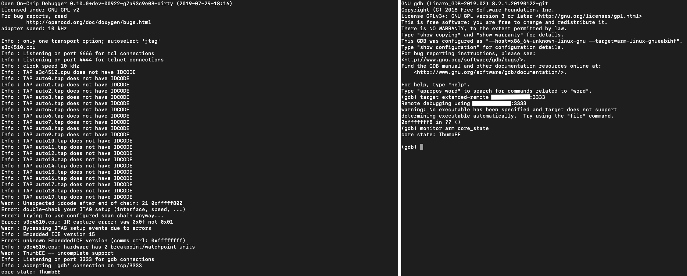

# OpenOCD demo in OpenBMC



This is how to get a "dummy" software only openOCD debug stack running on OpenBMC 

## Step 1: Include OpenOCD into your local conf.
First thing we need is to add OpenOCD into the scope of our BMC build. Thankfully someone has contributed a OpenOCD recipe into Yocto/OpenEmbbded. Unfortunately the setup is slightly out of date, but we'll update it.

add `IMAGE_INSTALL += "openocd"` into your conf file.

if you've already exported your conf (`$export TEMPLATECONF=meta-ibm/meta-witherspoon/conf`)
put it into `../openbmc/build/conf/local.conf`

Or:

if you'd like to add this to every build for the machine add it to the 
`<path_to_machine_conf>/local.conf.sample`
an example: `../openbmc/meta-ibm/meta-witherspoon/conf/local.conf.sample`


## Step 2: update the OpenOCD BB
next we need to update the OpenOCD Bitbake recipe in 
`../openbmc/meta-openembedded/meta-oe/recipes-devtools/openocd/openocd_git.bb`
At the time of writing this, I set it to pull the latest commit from master:
`SRCREV_openocd = "263deb3802a515ba8155b6c59146f0f539de4e43"`
and add the dummy interface so that we can start openOCD stack with no real hardware
`EXTRA_OECONF = "--enable-ftdi --disable-doxygen-html --enable-dummy"`
Extra_OECONF is where you would add options you’d normally add to the OpenOCD configure step

## Step 3: add Conf within QEMU (this should be able to be automated)
for now, we need to locate the installed OpenOCD scripts, which are `.tcl` files. a simple `$ find / *.tcl` should be able to point you in the right direction 
two examples, where I moved them to my home directory to make them easier to work with.
`root@witherspoon:~# cp -r /media/rofs-704e5dc2/usr/share/openocd/scripts/ ~`
`root@palmetto:~# cp -r /run/initramfs/ro/usr/share/openocd/scripts/ ~`

create a new `openocd.cfg` with the contents

```
bindto 0.0.0.0
adapter_khz 10
```
This `adapter_khz` value is just for dummy debugging, and we are exposing openOCD to the network with `bindto 0.0.0.0`

## Step 4: run OpenOCD with configs
dummy example:
`root@witherspoon:~# openocd -f openocd.cfg -f scripts/interface/dummy.cfg -f scripts/board/arm_evaluator7t.cfg`
